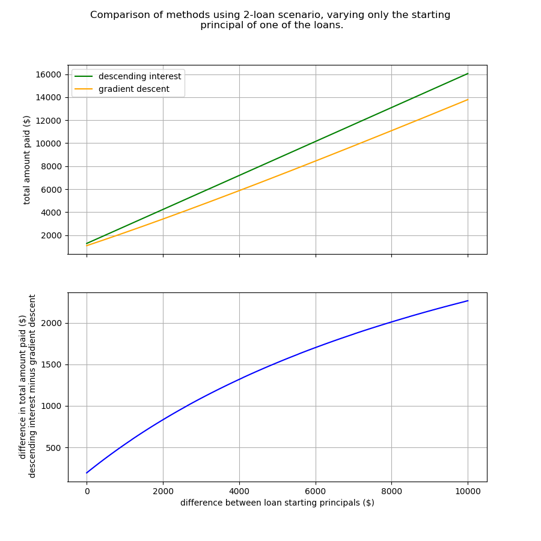

# Loan_Payment_Optimizer

## Descripton:
Python code to determine how to allocate extra money to pay off debt faster.

## Basic explanation:

You have a bunch of debts. They are probably in the form of loans paid off
in installments over time. These are know as amortized loans.

Examples of amortized loans include credit card debts, mortgages, 
and student loans.

The mantra I've seen over and over again, is that the optimal way to pay
off these debts is something called the "higher rate" or "descending interest" 
method by which you pay off your debts by interest rate from highest to
lowest [1].

I wanted to test to see if the descending interest method was always optimal.
To test this hypothesis, I coded up a simple algorithm I call the "gradient
descent" method. It operates on a set of loans by seeing which loan's
total cost (the interest + principal you pay over life of the loan) is
reduced the most by applying an absolute amount of money over the fixed
minimum payment. You can read more about the function in its comments
within the _loan_function.py_ file.

The "gradient descent" method was a competitor for the "descending interest"
method, which I hypothesized would, at least some of the time, result in
a lower total cost paid.

I put the hypothesis to the test in two separate ways:  
_1_ - By running a bunch of debt scenarios through each of the algorithms.  
_2_ - By a simple total cost plot made varying only one loan parameter for a two-loan scenario.

The bottom line is the descending interest method is not always optimal,
although I do think it's a good rule of thumb.

To see the results of _1_, see README.md in the _loan_function_test_1_in4_
sub-directory.

The results of _2_ are shown below. Please look at the simple code
_method_compare_1.py_ to see what I did.

The figure above shows how the gradient descent method reduces the total cost 
paid over the life of two loans assuming the following...  
1. The annual interest of _loan A_ is 35%.
2. The annual interest of _loan B_ is 10%.
3. The term of both loans is 100 months.
4. The amount of money to allocate (as determined by each method) to apply above the minimum payments is $100.
5. The starting principal of _loan A_ is $500.
6. The starting principal of loan B varies. It varies from being equal to loan A's
starting principal to + $10000 greater.

The top plot in the figure compares the total cost of the two methods as a function
of the increases in loan B's starting principal. The bottom plot explicitly shows how much
money you would save using the same x-axis.

Granted, I picked a case where I knew the gradient descent method would win.
But the point is that the descending interest method is not always optimal
if you are trying to reduce your total cost paid.

If you look at the results of _1_, the many debt scenarios, you'll see that
the majority of the time the gradient descent outperforms the descending interest
method, and in cases where it does not, it doesn't "lose" by much.

## System requirements:
- Python 3.X
- No obscure Python libraries required. 

## References:
[1] https://www.khanacademy.org/college-careers-more/personal-finance/pf-interest-and-debt/debt-repayment/v/high-rate-vs-snowball-method

## Notes:

{30 May 2020}
Work on/finesse output of analyze_results.py
