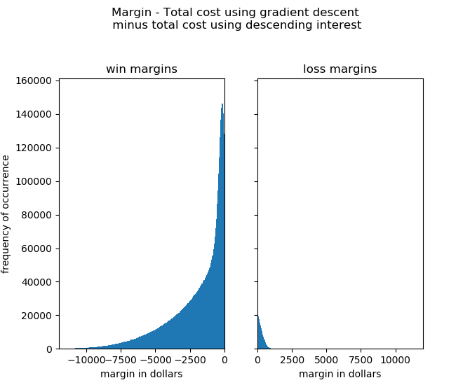

# Description of test
1. 10271580 scenarios were run. There were 3 loans per scenario.
    * The scenarios were generated by computing all possible combinations of 
    3 loans from all possible combinations of "p," "i," and "n."
    * See one of the "loan_function_test*.py" codes for more details.
2. For each scenario, the total cost was computed using the 
"gradient descent" and "descending interest" methods.
3. If the total cost using "gradient descent" was less than that of "descending
interest" then this was considered a "win." Otherwise it was considered a "loss."
4. The scenarios were partitioned into 4 separate codes that could be run
simultaneously - a crude form a parallel processing.

# Summary of test results
DEFINITION:
_margin = (total cost of debt using gradient descent method) - (total cost of debt using descending interest method)_

With the above definition in mind, look the plotted summary of results below.

In the left histogram, the negative number means that the gradient descent method's total cost was that much lower than the descending interested method. In the right histogram, the gradient descent's total cost was that much higher.

Here are some basic stats to go with this histogram...

% wins:        84.30 
% losses:      15.70
mean win ($):  -2052.71
mean loss ($): 261.62
max win ($):   -19637.97
max loss ($):  7223.13
min win ($):   -0.00
min loss ($):   0.00
